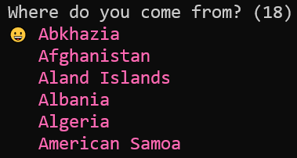

# ask
Simple Node.js CLI library to display a list of scrollable choices and ask user for selection.

### Introduction
Ask is a Node.js module that offers an easy-to-use API to display a list of scrollable choices.
The end-user navigates the choices with the up arrow and down arrow keys, and presses the Enter
key for selection. Configurable options are shown below:
- 8-bit and 24-bit text terminal colors.
- Number of rows in the scrollable window.
- Selection pointer can be specified with a UTF-8 string.

### Prerequisites
- The file `ask.js` requires Node.js >= 14.0.0 due to usage of the ES2020 optional chaining operator (?.).
- The file `ask.js` has zero external dependencies.

### Getting Started
Call the `ask` function with an array of choices followed by an `options` object:
```
'use strict'
const ask = require('./ask')

async function main() {
    const choices = [
        'Abkhazia',
        'Afghanistan',
        'Aland Islands',
        'Albania',
        'Algeria',
        'American Samoa',
        'Andorra',
        'Angola',
        'Anguilla',
        'Antarctica',
        'Antigua and Barbuda',
        'Argentina',
        'Armenia',
        'Aruba',
        'Ascension',
        'Australia',
        'Austria',
        'Azerbaijan',
    ]

    console.log(`Where do you come from? (${choices.length})`)
    const answer = await ask(choices, { color: 'HotPink', maxWindow: 6, pointer: '😀' })
    console.log(choices[answer])
}

main()
```



The `ask` function can also be called without passing in the `options` argument.
Type `npm start` or `node main.js` on the command line for a simple demo.

### Text Terminal Color Support
Text terminal colors are displayed using
[ANSI escape codes](https://en.wikipedia.org/wiki/ANSI_escape_code) that were introduced in the 1970s.
However, the `ask` function hides all the details from the developer and hence colors may be
specified using:
- A `number` type (8-bit indexed color; e.g. `{ color: 6 }` for cyan), or
- A `string` type (24-bit RGB color; see below for details)

For 8-bit color, refer to the [256-color lookup table](https://en.wikipedia.org/wiki/ANSI_escape_code#8-bit)
on Wikipedia.

For 24-bit color, CSS **named-colors**, **hex-colors**, **rgb-colors** and **hsl-colors** are supported
via the file `css-colors.js`. Examples are shown below:
- `{ color: 'CornflowerBlue' }`
- `{ color: '#fe10ca' }`, `{ color: '#d2b' }`
- `{ color: 'rgb(188,0,95)' }`, `{ color: 'rgb(0%,50%,100%)' }`
- `{ color: 'hsl(0,100%,50%)' }`

Below are a list of usage notes for 24-bit color string values:
- All color values are case-insensitive.
- Spaces should not be used within the color values.
- Invalid color values are silently ignored.
- A list of [CSS color names](https://www.w3schools.com/cssref/css_colors.asp) can be found on w3schools.com.

The file `css-colors.js` must be present if you want 24-bit color support. That file may be removed if
you are fine with 8-bit color or whatever color your text terminal was already set up to display.

### Authors
* **Steve Leong** - *Initial work*

### License
This project is licensed under the MIT License - see the LICENSE file for details.
